# Agents

Agent library for AI tools working in SolTechnology.Core. An **agent** is a role with a multi-step
workflow and a fixed contract — distinct from a **skill** (a narrow procedure under
[`../skills/`](../skills/)).

Before invoking an agent you **must** `read_file` its `.agent.md`. Agents are not pre-loaded.
Conventions, tool list, handoffs and output formats live only inside the file.

## Index

| Agent | When to invoke | Hands off to |
|---|---|---|
| [implementation-planning](implementation-planning.agent.md) | Planning a new feature, multi-module change, or breaking API change. Produces an ADR + step files under [`docs/adr/<NNN>-<feature>/to-do/`](../../docs/adr/). | [plan-reviewer](plan-reviewer.agent.md) |
| [plan-reviewer](plan-reviewer.agent.md) | Critiquing a plan in `docs/adr/<NNN>-<feature>/to-do/`. Writes revised drafts to `reviewed/`, deletes originals from `to-do/`. Never writes production code, never mutates `done/`. | premortem skill (mandatory gate before implementation) |
| [diagram](diagram.agent.md) | Authoring a sequence or component diagram under [`docs/diagrams/`](../../docs/diagrams/). Mermaid only, five canonical layer boxes, immutable file per version. | — |

## Agent vs Skill — which kind is this?

| Question | If yes → | If no → |
|---|---|---|
| Owns a multi-turn workflow with handoffs? | Agent | Skill |
| Loaded for a single narrow procedure (commit message, review, doc cleanup)? | Skill | Agent |
| Reads broad context (codebase, ADRs, docs) before acting? | Agent | Skill |
| Has a fixed output artifact spec (template, file location)? | Either — both ship templates |

Filename conventions:

- **Agent**: `.github/agents/<name>.agent.md` (one file).
- **Skill**: `.github/skills/<name>/SKILL.md` (folder; optional `references/` subfolder).

## Workflow

```mermaid
flowchart LR
    Start([Task]) --> Vague{Vague?}
    Vague -->|yes| Roast[skill: roast-me]
    Vague -->|no| Plan[agent: implementation-planning]
    Roast --> Plan
    Plan --> Review[agent: plan-reviewer]
    Review --> BlueRed[skill: blue-red-team]
    BlueRed --> Premortem[skill: premortem]
    Premortem -->|Go| Impl[skill: implement-plan]
    Impl --> CodeReview[skill: code-review]
    CodeReview --> DocCleanup[skill: documentation-cleanup]
    DocCleanup --> Commit[skill: commit-message]
    Commit --> End([Merge])
```

All agents in this diagram are shipped. The `roast-me` and `implement-plan` skills live at
[`../skills/`](../skills/).

## Self-improvement

Rules for editing agent files are the same as for skills — see
[`docs/ClaudeCodingGuide.md` §19](../../docs/ClaudeCodingGuide.md). When you add a new agent,
update the index above in the same change.
