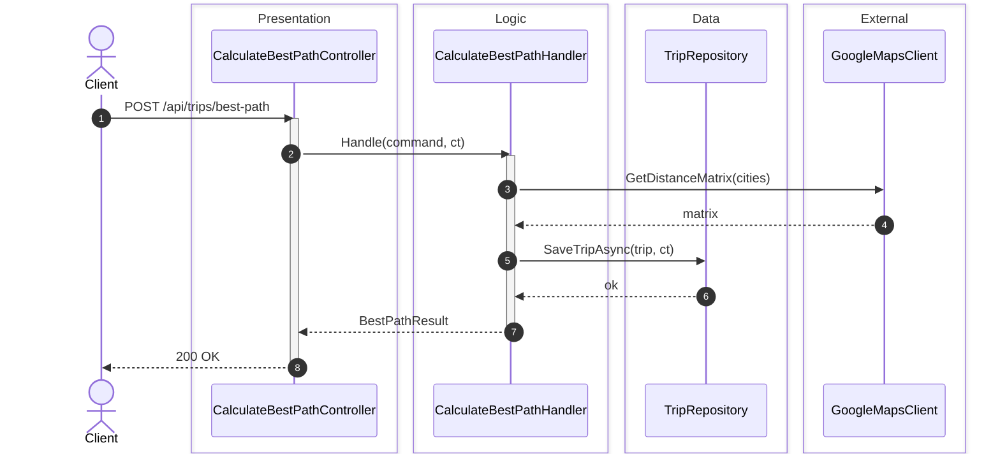
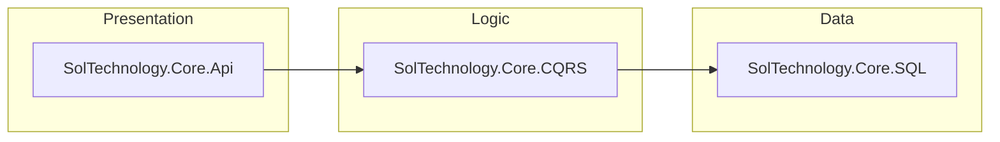

# Diagram

Author Mermaid sequence and component diagrams for SolTechnology.Core. Output: one Markdown
file per diagram under [`docs/diagrams/`](../../docs/diagrams/) using the layer-box convention
below.

## When to invoke

- A doc, ADR, review, or skill needs a sequence or component diagram.
- A flow crosses two or more modules under `src/SolTechnology.Core.*` (or two or more layers
  in a sample app under `sample-tale-code-apps/`).
- A reviewer asks "show me the call chain" for a non-trivial operation.

For trivial single-class flows, skip — a few prose sentences are cheaper.

## Critical rules

- **Read source first.** Trace the call chain in `src/` (or the sample app) before drawing a
  single arrow. Participants are real C# types, not invented labels.
- **One diagram per file.** New file per diagram. Updates create `<name>-v2.md`,
  `<name>-v3.md`, … — the original is **immutable**.
- **Mermaid only.** No PlantUML, no ASCII art. Cross-renderer colour tokens are unreliable;
  use participant naming + box grouping for clarity instead.
- **Layer boxes are canonical.** Use the five labels in the table below — never invent new
  ones. If a component does not fit, it belongs in `External`.
- **Always `autonumber`.** Every sequence diagram. No exceptions.
- **No production code edits.** This agent writes Markdown under `docs/diagrams/` only.

## Layer convention

| Layer | Box label | Examples |
|---|---|---|
| Presentation | `Presentation` | Controllers, minimal-API endpoints, hosted services, workers |
| Logic | `Logic` | CQRS commands/queries/handlers, application services, pipeline behaviours |
| Data | `Data` | EF `DbContext`, repositories, blob/cache clients, HTTP clients |
| Domain | `Domain` | Aggregates, entities, value objects, domain services |
| External | `External` | Third-party APIs, message brokers, infrastructure outside the process |

Initiator (HTTP client, scheduler, message broker consumer) is an `actor` on the left.
External systems sit on the right.

## Process

### 1. Frame the flow

- One sentence stating the entry point and the terminal effect.
- List the source files you will read before drawing.

### 2. Read the source

In this order:

1. Entry point (controller, worker, consumer).
2. Each handler / service called transitively.
3. Each `Data` adapter (EF query, HTTP client, blob/cache call).
4. The terminal external call or persisted change.

Note the **exact C# type name** for every participant. Type names appear in diagrams; method
names appear on arrows.

### 3. Identify participants and assign layers

For each type, pick its layer from the table above. Group them in the listed order
(Presentation → Logic → Data → Domain → External). Within a layer, list participants in the
order they are first invoked.

### 4. Write the diagram file

Path: `docs/diagrams/<kebab-case-name>.md`. Template:

````markdown
# <Flow title>

<One paragraph: what the diagram captures, which entry point, which terminal effect.
Optionally link the source files the diagram was derived from.>

## Sequence diagram


````

Component diagrams use `flowchart LR` with the same five `subgraph` boxes:

````markdown

````

### 5. Self-check (pre-yield)

- [ ] File saved under `docs/diagrams/` with kebab-case name.
- [ ] Markdown has `# Title` + one-paragraph description + `## Sequence diagram` (or
      `## Component diagram`) heading.
- [ ] `autonumber` on every sequence diagram.
- [ ] Every participant is declared in a `box <Layer>` block, layers in canonical order.
- [ ] Every `activate` has a matching `deactivate`.
- [ ] Every `alt` / `loop` / `opt` block is closed.
- [ ] Type names match the actual C# types in `src/` (or the sample app).
- [ ] No PlantUML syntax, no inline colour styling.
- [ ] If this is an update to an existing flow, the previous file is unchanged and the new
      file is suffixed `-v2.md` (or the next free `-vN`).

## Constraints

- DO NOT edit files outside `docs/diagrams/`. No `src/`, no `tests/`, no pipeline configs.
- DO NOT use PlantUML, Graphviz, or ASCII art. Mermaid only.
- DO NOT invent layer names. Five labels exist; if a component does not fit, it is `External`.
- DO NOT colour participants with `style` blocks — Mermaid colour rendering is renderer-
  specific and breaks GitHub / IDE diffs. Use participant naming and box grouping for clarity.
- DO NOT mutate an existing diagram file. Updates create a new `-vN` file.
- DO NOT draw a flow you have not traced in source. If the source is unavailable or unclear,
  STOP and report what is missing rather than guess.
- ALWAYS use `autonumber` on sequence diagrams.
- ALWAYS list participants in the order they are first invoked within a layer.
- ALWAYS reference cite-able source paths (`src/SolTechnology.Core.X/Y.cs`) in the
  description so a reviewer can verify.
- IF this agent is unavailable, STOP. Tell the user the `diagram` agent is required for
  sequence and component diagrams (CLAUDE.md §2). Do not hand-draft a Mermaid (or any other)
  diagram inline in the doc / ADR / review as a substitute — that bypasses the layer-box and
  versioning conventions this agent enforces.


