# Skills

Skill library for AI agents working in SolTechnology.Core. A **skill** is a narrow procedure
loaded on demand for a single task — distinct from an **agent** (a role with a multi-step
workflow under [`../agents/`](../agents/)).

Before invoking a skill you **must** `read_file` its `SKILL.md`. Skills are not pre-loaded —
their instructions live only inside the file. Never infer what a skill does from its name.
Conventions, references, and output formats live only inside `SKILL.md`.

## Index

| Skill | When to use | Premortem coupling |
|---|---|---|
| [premortem](premortem/SKILL.md) | Mandatory for `CLAUDE.md §4` triggers; recommended for other high-risk changes. **The primary risk gate.** | self |
| [blue-red-team](blue-red-team/SKILL.md) | Compare design alternatives inside a feature plan. | runs *before* premortem |
| [code-review](code-review/SKILL.md) | Reviewing a diff against Coding Guide + module review templates. | checks canonical premortem triggers |
| [commit-message](commit-message/SKILL.md) | Producing a Conventional Commits message with semver footer. | reads premortem output |
| [documentation-cleanup](documentation-cleanup/SKILL.md) | Validate architecture currency, dated feature records, module/doc parity, tables, Mermaid, and links. | independent |
| [package-management](package-management/SKILL.md) | Adding or bumping a `PackageReference`. Single source of truth for canonical versions. | independent |
| [dependency-audit](dependency-audit/SKILL.md) | Resolving `NU1901`–`NU1904` CVE warnings or `NU1605` downgrades. Drives fix-at-source over masking. | independent |
| [test-writing](test-writing/SKILL.md) | Authoring or extending tests under `tests/` (NUnit) or sample apps (NUnit for DreamTravel). | independent |
| [command-query-event-tale](command-query-event-tale/SKILL.md) | Authoring a command, query, event, or Tale (chapters) in any app on the `SolTechnology.Core.CQRS` / `.Tale` packages — per `ClaudeCodingGuide` §0/§3/§4/§11 and the DreamTravel reference app. Covers `Commands`/`Queries`, domain-model `DomainServices`, persisted `Workflows`, and `[LogScope]` logging. | independent |
| [refactor](refactor/SKILL.md) | Behaviour-preserving cleanup local to one module (rename internals, split a class, extract a primary ctor, pay down a §15 anti-pattern). | independent |
| [roast-me](roast-me/SKILL.md) | Vague request, under-specified intent, before any non-trivial planning. | runs *before* planning |
| [implement-plan](implement-plan/SKILL.md) | Execute one temporary step; close delivery by updating architecture and the durable feature record before collapse. | independent |

For multi-step planning, use the [implementation-planning](../agents/implementation-planning.agent.md)
agent — not a skill. See [`../agents/README.md`](../agents/README.md) for the agent index.

## Workflow

```mermaid
flowchart LR
    Start([Task]) --> Vague{Vague?}
    Vague -->|yes| Roast[skill: roast-me]
    Vague -->|no| Plan[agent: implementation-planning]
    Roast --> Plan
    Plan --> Review[agent: plan-reviewer]
    Review --> BlueRed[skill: blue-red-team]
    BlueRed --> Premortem[skill: premortem]
    Premortem -->|Go| Impl[skill: implement-plan]
    Impl --> CodeReview[skill: code-review]
    CodeReview --> DocCleanup[skill: documentation-cleanup]
    DocCleanup --> Commit[skill: commit-message]
    Commit --> End([Merge])
```

All listed skills are shipped. Agents (`implementation-planning`, `plan-reviewer`, `diagram`)
live at [`../agents/`](../agents/).

## Premortem gate

Apply the mandatory trigger list from `CLAUDE.md §4` exactly. Attach the skill's output to the PR.
Block on *Go* / *Go with mitigations* with mitigations in place. Apply confirmation gates separately
from `CLAUDE.md §2`; do not infer a premortem requirement from them. Current rationale lives in
[`docs/architecture/ai-assisted-development.md`](../../docs/architecture/ai-assisted-development.md).

## Package-companion skills

A **package-companion skill** encodes the usage of a shipped NuGet package (e.g.
[command-query-event-tale](command-query-event-tale/SKILL.md) for `SolTechnology.Core.CQRS` /
`.Tale`). It serves two audiences through two different delivery channels:

| Audience | Delivery | Mechanism |
|---|---|---|
| Repo contributors | Auto-loaded | Lives in `.github/skills/<name>/SKILL.md`; the agent discovers it from the workspace, same as every skill. |
| Package consumers (other repos) | Pull, opt-in | Linked from the package README (`docs/<Module>.md`, packed as `PackageReadmeFile`) with an **absolute** GitHub URL. The consumer points their agent at the file or copies it into their own `.github/skills/`. |

Rules:

- The skill file **MUST** live in `.github/skills/` like every other skill — NEVER inside `src/`
  and NEVER inside the `.nupkg`. A skill under `src/` loses auto-discovery; a markdown file in a
  `.nupkg` lands in `~/.nuget` where no agent reads it.
- The package README (`docs/<Module>.md`) **MUST** link the companion skill from a
  `### Working with AI Agent` section (see the
  [`Public Documentation Guide`](../../docs/PublicDocumentationGuide.md)).
  Links **MUST** be absolute `https://github.com/AdrianStrugala/SolTechnology.Core/blob/master/…`
  URLs — nuget.org does not resolve repo-relative links to `.github/`.
- Delivery is **pull, never push.** NEVER ship a build `.targets`, analyzer, or tool that writes a
  skill into a consumer's repository without an explicit, documented opt-in command. Silent
  copying into someone's `.github/` is forbidden.
- Link, never copy. The skill cites the Coding Guide §-numbers, the README links the skill, the
  skill links the guide — one source of truth.

## Self-improvement

Rules for editing skill files are in [`docs/ClaudeCodingGuide.md` §19](../../docs/ClaudeCodingGuide.md).
When you add or remove a skill, update the index above and `CLAUDE.md §4` in the same change.
