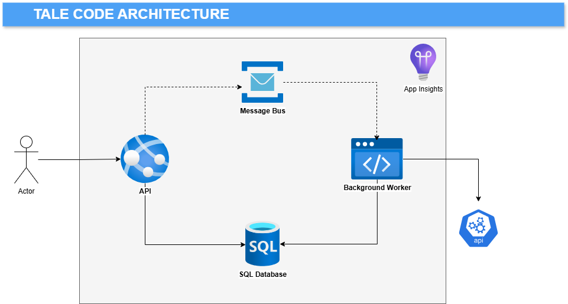

<p align="center">
    
</p>

<h2 align="center">
  SolTechnology.Core
</h2>

<p align="center">
 <a>Modern readable coding</a>
</p>

<p align="center">
 <a href="https://dotnet.microsoft.com/download/dotnet/10.0"></a>
<a href="https://www.nuget.org/packages?q=SolTechnology">
  
</a>
 <a href="https://github.com/AdrianStrugala/SolTechnology.Core/actions"></a>
</p>

<i>
<p align="center">
"Clean code is simple and direct. Clean code reads like well-written prose. Clean code never obscures the designer's intent but rather is full of crisp abstractions and straightforward lines of control."
</p>
<p align="right">
~Grady Booch, author of 'Object-Oriented Analysis and Design with Applications'
</p>
</i>

## Core Libraries

The SolTechnology.Core repository contains a set of shared libraries. This is a foundation for CQRS-driven applications using basic Azure technologies. The libraries support a modern coding approach presented in the example applications.


| Documentation                                                                                                    | Tags                                   | NuGet                                                                                                                                                   |
|------------------------------------------------------------------------------------------------------------|----------------------------------------|---------------------------------------------------------------------------------------------------------------------------------------------------------|
| [Core (foundation)](https://github.com/AdrianStrugala/SolTechnology.Core/tree/master/docs/CQRS.md#result-pattern) | `Result`, `Error`, `Foundation`        | <a href="https://www.nuget.org/packages/SolTechnology.Core/"></a>                       |
| [API](https://github.com/AdrianStrugala/SolTechnology.Core/tree/master/docs/Api.md)                        | `API`, `Web`, `Controllers`            | <a href="https://www.nuget.org/packages/SolTechnology.Core.Api/"></a>               |
| [HTTP](https://github.com/AdrianStrugala/SolTechnology.Core/tree/master/docs/Clients.md)<br><sub>succeeds `SolTechnology.Core.ApiClient` — [deprecated libraries](dontreadme.md)</sub>           | `HTTP`, `Client`, `REST`               | <a href="https://www.nuget.org/packages/SolTechnology.Core.HTTP/"></a>    |
| [AUID](https://github.com/AdrianStrugala/SolTechnology.Core/tree/master/docs/AUID.md)                      | `GUID`, `UUID`, `ID`, `Identifier`     | <a href="https://www.nuget.org/packages/SolTechnology.Core.AUID/"></a>             |
| [Authentication](https://github.com/AdrianStrugala/SolTechnology.Core/tree/master/docs/Auth.md)            | `Auth`, `Security`, `Basic`, `API key`              | <a href="https://www.nuget.org/packages/SolTechnology.Core.Authentication/"></a> |
| [Blob Storage](https://github.com/AdrianStrugala/SolTechnology.Core/tree/master/docs/Blob.md)<br><sub>succeeds `SolTechnology.Core.BlobStorage` — [deprecated libraries](dontreadme.md)</sub>              | `Azure`, `Blob`, `Storage`, `no-SQL`             | <a href="https://www.nuget.org/packages/SolTechnology.Core.Blob/"></a> |
| [Cache](https://github.com/AdrianStrugala/SolTechnology.Core/tree/master/docs/Cache.md)                    | `Cache`, `Memory`, `Performance`       | <a href="https://www.nuget.org/packages/SolTechnology.Core.Cache/"></a>           |
| [CQRS](https://github.com/AdrianStrugala/SolTechnology.Core/tree/master/docs/CQRS.md)                      | `CQRS`, `Patterns`, `Architecture`     | <a href="https://www.nuget.org/packages/SolTechnology.Core.CQRS/"></a>             |
| [Hangfire](https://github.com/AdrianStrugala/SolTechnology.Core/tree/master/docs/Hangfire.md)              | `Hangfire`, `Events`, `Jobs`, `Cron`   | <a href="https://www.nuget.org/packages/SolTechnology.Core.Hangfire/"></a>       |
| [Tale Framework](https://github.com/AdrianStrugala/SolTechnology.Core/tree/master/docs/Tale.md)<br><sub>succeeds `SolTechnology.Core.Story` — [deprecated libraries](dontreadme.md)</sub>          | `Workflow`, `Interactive`, `Tale Code` | <a href="https://www.nuget.org/packages/SolTechnology.Core.Tale/"></a>             |
| [Logging](https://github.com/AdrianStrugala/SolTechnology.Core/tree/master/docs/Log.md)                    | `Logging`, `Diagnostics`, `Tracing`    | <a href="https://www.nuget.org/packages/SolTechnology.Core.Logging/"></a>       |
| [Message Bus](https://github.com/AdrianStrugala/SolTechnology.Core/tree/master/docs/Bus.md)                | `Azure`, `Messaging`, `Async`, `Queue`          | <a href="https://www.nuget.org/packages/SolTechnology.Core.MessageBus/"></a>  |
| [SQL Database](https://github.com/AdrianStrugala/SolTechnology.Core/tree/master/docs/SQL.md)               | `Database`, `SQL`, `ORM`, `Dapper`, `EF`               | <a href="https://www.nuget.org/packages/SolTechnology.Core.SQL/"></a>           |

> 📦 [Deprecated libraries](dontreadme.md)


### Testing companions

Modular NUnit `.Testing` packages for component / integration tests — one companion per concern, all on
the shared `SolTechnology.Core.Testing` foundation. Reference from test projects only.

| Documentation                                                                                                              | Tags                                   | NuGet                                                                                                                                                                       |
|----------------------------------------------------------------------------------------------------------------------------|----------------------------------------|----------------------------------------------------------------------------------------------------------------------------------------------------------------------------|
| [Testing (foundation)](https://github.com/AdrianStrugala/SolTechnology.Core/tree/master/docs/Testing.md)                   | `Testing`, `NUnit`, `AutoFixture`      | <a href="https://www.nuget.org/packages/SolTechnology.Core.Testing/"></a>                     |
| [API Testing](https://github.com/AdrianStrugala/SolTechnology.Core/tree/master/docs/Api.md#testing)                        | `TestServer`, `Integration`            | <a href="https://www.nuget.org/packages/SolTechnology.Core.API.Testing/"></a>             |
| [SQL Testing](https://github.com/AdrianStrugala/SolTechnology.Core/tree/master/docs/SQL.md#testing)                        | `SQL`, `Postgres`, `Testcontainers`    | <a href="https://www.nuget.org/packages/SolTechnology.Core.SQL.Testing/"></a>             |
| [HTTP Testing](https://github.com/AdrianStrugala/SolTechnology.Core/tree/master/docs/HTTP.Testing.md)                      | `HTTP`, `WireMock`, `Mocks`            | <a href="https://www.nuget.org/packages/SolTechnology.Core.HTTP.Testing/"></a>           |
| [Redis Testing](https://github.com/AdrianStrugala/SolTechnology.Core/tree/master/docs/Redis.Testing.md)                    | `Redis`, `Cache`, `Testcontainers`     | <a href="https://www.nuget.org/packages/SolTechnology.Core.Redis.Testing/"></a>         |
| [Blob Storage Testing](https://github.com/AdrianStrugala/SolTechnology.Core/tree/master/docs/Blob.Testing.md)       | `Azure`, `Blob`, `Azurite`             | <a href="https://www.nuget.org/packages/SolTechnology.Core.Blob.Testing/"></a> |
| [Service Bus Testing](https://github.com/AdrianStrugala/SolTechnology.Core/tree/master/docs/ServiceBus.Testing.md)         | `Azure`, `Service Bus`, `Emulator`     | <a href="https://www.nuget.org/packages/SolTechnology.Core.ServiceBus.Testing/"></a> |


## Tale Code

The idea of clean and readable code has stayed with me from the very beginning of my career. As a book lover and amateur writer, this is the most natural part of programming.\
In the Tale Code approach, I am trying to summarize all the information about coding, design, automation, and configuration that I have learned over the years. The Tale Code rule is simple:

<i>
<p align="center">
"Make your code a pleasure to read, like a tale."
</p>
<p align="right">
~Adrian Aleksander Strugała
</p>
</i>

The sample application is the most common case that came to my mind. It's built of a user-facing API and a background worker responsible for fetching data and feeding the SQL database. The communication between these two is asynchronous and based on messages, as shown in the picture:



<p>
<b>Code design is the main goal</b> of Tale Code. Logical flow and code structure are described in detail, and it reads like a well-written story:

```csharp
public class CalculateBestPathTale(IServiceProvider serviceProvider, ILogger<CalculateBestPathTale> logger)
    : TaleHandler<CalculateBestPathQuery, CalculateBestPathContext, CalculateBestPathResult>(serviceProvider, logger),
      IQueryHandler<CalculateBestPathQuery, CalculateBestPathResult>
{
    protected override Tale<CalculateBestPathResult> Tell() =>
        Open<InitiateContext>()
            .Expect(ctx => ctx.NoOfCities > 1,
                    new NotFoundError { Message = "A route needs at least two cities." })
            .Read<DownloadRoadData>()
            .Read<FindProfitablePath>()
            .Otherwise<JustOrderCities>()      // no profitable route → just order by distance
            .Read<SolveTsp>()
            .WhenLost(error => logger.LogWarning("Best path calculation failed: {Error}", error.Message))
            .Read<FormCalculateBestPathResult>()
            .Finale(ctx => ctx.Output);
}
```


I have summarized the knowledge and decisions into three chapters.\
Enjoy your reading! 
</p>


[1. The Design](https://github.com/AdrianStrugala/SolTechnology.Core/tree/master/docs/theDesign.md) \
[2. The Automation](https://github.com/AdrianStrugala/SolTechnology.Core/tree/master/docs/theAutomation.md) \
[3. The Quality](https://github.com/AdrianStrugala/SolTechnology.Core/tree/master/docs/theQuality.md)


*Some ending words*


