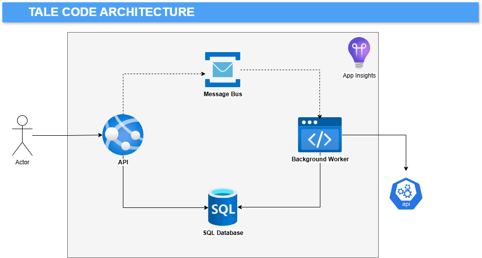

<p align="center">
    
</p>

<h2 align="center">
  SolTechnology.Core
</h2>

<p align="center">
 <a>Modern readable coding</a>
</p>

<p align="center">
 <a href="https://www.nuget.org/packages?q=SolTechnology"></a>
 <a href="https://github.com/AdrianStrugala/SolTechnology.Core/actions"></a>
 <a href="https://github.com/AdrianStrugala/SolTechnology.Core"></a>
</p>

<i>
<p align="center">
"Clean code is simple and direct. Clean code reads like well-written prose. Clean code never obscures the designer's intent but rather is full of crisp abstractions and straightforward lines of control."
</p>
<p align="right">
~Grady Booch, author of *Object-Oriented Analysis and Design with Applications*
</p>
</i>

## Core Libraries

The SolTechnology.Core repository contains a set of shared libraries. This is a foundation for CQRS-driven applications using basic Azure technologies. The libraries support a modern coding approach presented in the example applications.


| Documentation                                                                                                    | Tags                                   | NuGet                                                                                                                                                   |
|------------------------------------------------------------------------------------------------------------|----------------------------------------|---------------------------------------------------------------------------------------------------------------------------------------------------------|
| [SQL Database](https://github.com/AdrianStrugala/SolTechnology.Core/tree/master/docs/Sql.md)               | `Database`, `SQL`, `ORM`, `Dapper`, `EF`               | <a href="https://www.nuget.org/packages/SolTechnology.Core.Sql/"></a>           |
| [Blob Storage](https://github.com/AdrianStrugala/SolTechnology.Core/tree/master/docs/Blob.md)              | `Azure`, `Blob`, `Storage`, `no-SQL`             | <a href="https://www.nuget.org/packages/SolTechnology.Core.BlobStorage/"></a> |
| [HTTP Clients](https://github.com/AdrianStrugala/SolTechnology.Core/tree/master/docs/Clients.md)           | `HTTP`, `Client`, `REST`               | <a href="https://www.nuget.org/packages/SolTechnology.Core.ApiClient/"></a>    |
| [Message Bus](https://github.com/AdrianStrugala/SolTechnology.Core/tree/master/docs/Bus.md)                | `Azure`, `Messaging`, `Async`, `Queue`          | <a href="https://www.nuget.org/packages/SolTechnology.Core.MessageBus/"></a>  |
| [Guards](https://github.com/AdrianStrugala/SolTechnology.Core/tree/master/docs/Guards.md)                  | `Validation`, `Guards`, `Checks`       | <a href="https://www.nuget.org/packages/SolTechnology.Core.Guards/"></a>        |
| [Authentication](https://github.com/AdrianStrugala/SolTechnology.Core/tree/master/docs/Auth.md)            | `Auth`, `Security`, `Basic`, `API key`              | <a href="https://www.nuget.org/packages/SolTechnology.Core.Authentication/"></a> |
| [Logging](https://github.com/AdrianStrugala/SolTechnology.Core/tree/master/docs/Log.md)                    | `Logging`, `Diagnostics`, `Tracing`    | <a href="https://www.nuget.org/packages/SolTechnology.Core.Logging/"></a>       |
| [Scheduler](https://github.com/AdrianStrugala/SolTechnology.Core/tree/master/docs/Cron.md)                 | `Scheduler`, `Cron`, `Tasks`           | <a href="https://www.nuget.org/packages/SolTechnology.Core.Scheduler/"></a>    |
| [CQRS](https://github.com/AdrianStrugala/SolTechnology.Core/tree/master/docs/CQRS.md)                      | `CQRS`, `Patterns`, `Architecture`     | <a href="https://www.nuget.org/packages/SolTechnology.Core.CQRS/"></a>             |
| [API](https://github.com/AdrianStrugala/SolTechnology.Core/tree/master/docs/Api.md)                        | `API`, `Web`, `Controllers`            | <a href="https://www.nuget.org/packages/SolTechnology.Core.Api/"></a>               |
| [Cache](https://github.com/AdrianStrugala/SolTechnology.Core/tree/master/docs/Cache.md)                    | `Cache`, `Memory`, `Performance`       | <a href="https://www.nuget.org/packages/SolTechnology.Core.Cache/"></a>           |


## Tale Code

The idea of clean and readable code has stayed with me from the very beginning of my career. As a book lover and amateur writer, this is the most natural part of programming.\
In the Tale Code approach, I am trying to summarize all the information about coding, design, automation, and configuration that I have learned over the years. The Tale Code rule is simple:

<i>
<p align="center">
"Make your code a pleasure to read, like a tale."
</p>
<p align="right">
~Adrian Strugała
</p>
</i>

The sample application is the most common case that came to my mind. It's built of a user-facing API and a background worker responsible for fetching data and feeding the SQL database. The communication between these two is asynchronous and based on messages, as shown in the picture:



<p>
<b>Code design is the main goal</b> of Tale Code. Logical flow and code structure are described in detail, and it even follows a more human-friendly, functional-like notation:

```csharp
var context = new CalculateBestPathContext(cities!);

var result = await Chain
     .Start(context, cancellationToken)
     .Then(_downloadRoadData)
     .Then(_findProfitablePath)
     .Then(_solveTSP)
     .End(_formResult);
```


I have summarized the knowledge and decisions into three chapters.\
Enjoy your reading! 
</p>


[1. The Design](https://github.com/AdrianStrugala/SolTechnology.Core/tree/master/docs/theDesign.md) \
[2. The Automation](https://github.com/AdrianStrugala/SolTechnology.Core/tree/master/docs/theAutomation.md) \
[3. The Quality](https://github.com/AdrianStrugala/SolTechnology.Core/tree/master/docs/theQuality.md)

*Some ending words*


