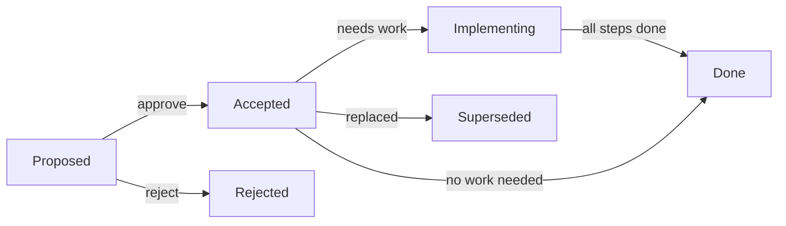

# Architecture Decision Records

Decisions that shape SolTechnology.Core. One ADR = one decision. Filenames follow
`NNN-kebab-title.md`, monotonic numbering, no gaps.

## Index

| # | Title | Created | Status | Implementation |
|---|---|---|---|---|
| 001 | [Acronym capitalization refactoring](001-acronym-capitalization-refactoring.md) | 2025-12-30 | Accepted | ✅ Done |
| 002 | [Story Framework implementation](002-Story-Framework-Implementation.md) | 2026-01 | Accepted | ✅ Done |
| 003 | [API versioning strategy](003-api-versioning-strategy.md) | 2026-01-02 | Accepted | ✅ Done |
| 004 | [AI agents and skills](004-ai-agents-and-skills.md) | 2026-05-15 | Accepted | ✅ Done |
| 005 | [HTTP production defaults](005-http-production-defaults.md) | 2026-05-15 | Accepted | ✅ Done |
| 006 | [Implementation plan workflow](006-implementation-plan-workflow.md) | 2026-05-25 | Accepted | ✅ Done |
| 007 | [CQRS production hardening + in-house mediator](007-cqrs-production-hardening.md) | 2026-05-26 | Accepted | ✅ Done |
| 008 | [Testing framework `.Testing` companion packages](008-testing-framework-companions.md) | 2026-05-30 | Accepted | 🔍 Implementing — 10/11 shipped; only [publish workflow](008-testing-framework-companions/reviewed/09-publish-workflow.md) left (see [summary](008-testing-framework-companions.md#implementation-summary)) |
| 009 | [Persistent events and recurring jobs via `SolTechnology.Core.Hangfire`](009-hangfire-persistent-events-and-jobs.md) | 2026-06-09 | Accepted | ✅ Done |
| 010 | [Production hardening of SolTechnology.Core libraries](010-production-pattern-adoption-programme.md) | 2026-06-12 | Accepted | 🔍 Implementing — see [summary](010-production-pattern-adoption-programme/summary.md) |
| 011 | [Extract SQLite Story persistence into the DreamTravel sample](011-story-sqlite-extraction.md) | 2026-06-22 | Accepted | ✅ Done |
| 012 | [Production pattern adoption — wave 2](012-production-pattern-adoption-wave-2.md) | 2026-06-24 | Accepted | ✅ Done — see [Implementation summary](012-production-pattern-adoption-wave-2.md#implementation-summary) |

Status values: `Proposed` / `Accepted` / `Superseded` / `Rejected`.
Implementation values: `N/A` / `⬜ To-do` / `🔍 Implementing` / `✅ Done`.

## Plan workflow (canonical)

Authoritative source: [ADR-006](006-implementation-plan-workflow.md). Summary mirrored here:

- **Plans live next to their ADR.** Multi-step work for ADR-`NNN` lives in
  `docs/adr/NNN-feature-name/`.
- **Three folders, mutually exclusive states.**
  ```
  NNN-feature-name/
    summary.md
    to-do/        ← steps not yet started
    reviewed/     ← drafts produced by the `plan-reviewer` agent
    done/         ← completed steps
  ```
- **Step files**: `NN-step-title.md` (numeric, kebab-case, no dates).
- **Premortem is the gate — numbered `00`.** Every plan's premortem step is `00-run-premortem.md`,
  authored last but **executed first**. Because step numbers encode execution order, the
  "lowest `⬜ to-do` first" rule runs it before step `01`. No implementation step ships until `00`
  returns *Go* / *Go with mitigations* ([ADR-006 §5](006-implementation-plan-workflow.md)).
- **`summary.md`** is the row-by-row tracker. Status column uses `⬜ to-do` / `🔍 reviewed` /
  `✅ done`. Link in each row points to the step's current location.
- **ADRs without multi-step work have no sibling folder.**
- **Update this index** whenever an ADR is added or its status changes.

## How an ADR moves through the system



For agents picking up work:

1. Open this index. Find an ADR with `🔍 Implementing` status. ADRs marked `✅ Done` have no
   working folder — their `## Implementation summary` section in the ADR file is the record.
2. Open its `summary.md`. Find the next `⬜ to-do` step.
3. **If that step is `00` (premortem gate), run it first** — invoke the
   [`premortem`](../../.github/skills/premortem/SKILL.md) skill, record the verdict, and only
   proceed when it returns *Go* / *Go with mitigations*. No `01..NN` step starts until `00` is done.
4. Open the step file in `to-do/` (or `reviewed/`).
5. Invoke the [`implement-plan`](../../.github/skills/implement-plan/SKILL.md) skill.

## Creating a new ADR

- Pick the next free `NNN` from the table above.
- Filename `NNN-kebab-title.md`. Required sections: Status, Context, Decision, Consequences.
- Recommended sections: Alternatives Considered, Related.
- Add a row to the index in the same PR.
- If the ADR drives multi-step work, also create `NNN-kebab-title/summary.md` and seed `to-do/`.


