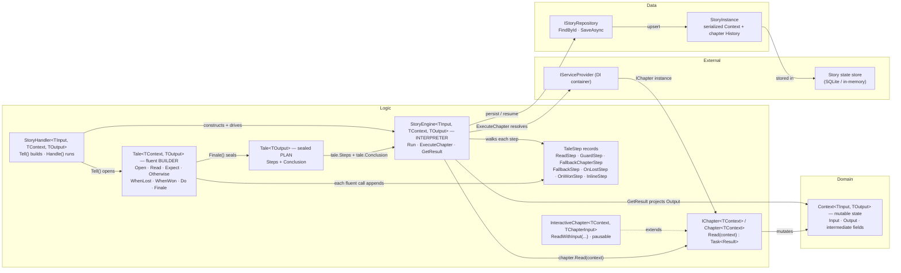

# Story framework — core type structure (plan vs interpreter)

How the Story framework's core types relate after the railway→Tale migration. The diagram
captures *ownership* and the central **plan vs interpreter** split: `StoryHandler.Tell()` builds
an immutable `Tale<TOutput>` *plan* (an ordered list of `TaleStep` records plus a concluding
projection) and the `StoryEngine` *interprets* that plan against one live, mutable `Context`,
resolving each `Chapter` from DI and letting it mutate the shared state. Derived from
[`StoryHandler.cs`](../../src/SolTechnology.Core.Story/StoryHandler.cs),
[`Tale/Tale.cs`](../../src/SolTechnology.Core.Story/Tale/Tale.cs),
[`Tale/TaleStep.cs`](../../src/SolTechnology.Core.Story/Tale/TaleStep.cs),
[`Orchestration/StoryEngine.cs`](../../src/SolTechnology.Core.Story/Orchestration/StoryEngine.cs),
[`Chapter.cs`](../../src/SolTechnology.Core.Story/Chapter.cs) /
[`IChapter.cs`](../../src/SolTechnology.Core.Story/IChapter.cs) /
[`InteractiveChapter.cs`](../../src/SolTechnology.Core.Story/InteractiveChapter.cs),
[`Context.cs`](../../src/SolTechnology.Core.Story/Context.cs) and
[`Persistence/IStoryRepository.cs`](../../src/SolTechnology.Core.Story/Persistence/IStoryRepository.cs).
`Context` carries the story's evolving in-flight state, so it sits in `Domain`; the orchestration
types (`StoryHandler`, `Tale`, `StoryEngine`, `Chapter`) are application logic.

## Component diagram

## Reading the diagram

- **Plan, not execution.** `Tell()` returns a `Tale<TOutput>` — the `Tale<TContext, TOutput>`
  builder records one `TaleStep` per fluent call (`Read`→`ReadStep`, `Expect`→`GuardStep`,
  `Otherwise`→`FallbackChapterStep`/`FallbackStep`, `WhenLost`→`OnLostStep`,
  `WhenWon`→`OnWonStep`, `Do`→`InlineStep`) and `Finale(ctx => ctx.Output)` seals the list plus
  the conclusion projection into the immutable plan. No chapter has run yet.
- **One interpreter.** `StoryEngine.Run` switches over the recorded `TaleStep` types; a
  `ReadStep` triggers `ExecuteChapter`, which resolves `IChapter<TContext>` from the DI container
  and calls `Read(Context)`.
- **State flows through `Context`, not return values.** Chapters mutate the shared `Context`
  and return only `Result` to signal success/failure. `GetResult` projects the final `Context`
  into `TOutput` via the plan's `Conclusion`.
- **Railway semantics.** The story runs on a won/lost track; the first failing chapter switches
  it to lost and the engine skips later steps, unless an `Otherwise` clears the failure and
  resumes the won track.

