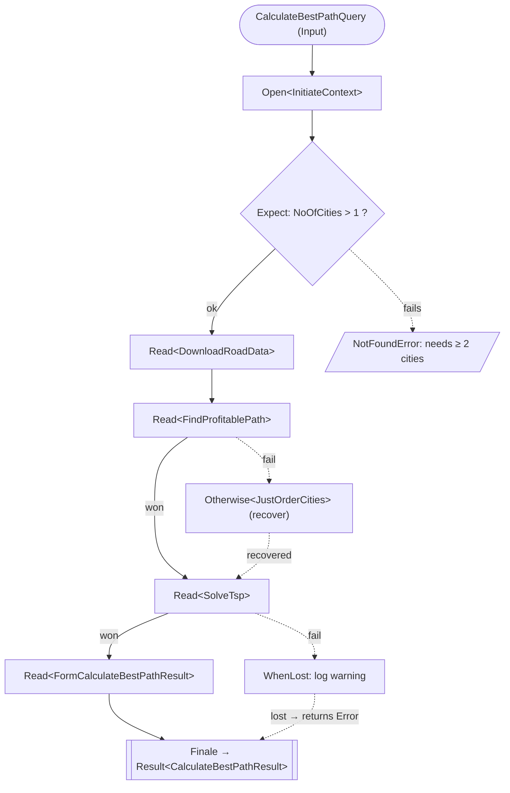

# Tale Code flow — `CalculateBestPathTale`

The DreamTravel hero Tale (`DreamTravel.Queries/CalculateBestPath/CalculateBestPathTale.cs`)
read as a flow. The `Tell()` plan narrates chapters on a **won / lost track**: a failing chapter
switches the story to the lost track and later chapters are skipped, unless an `Otherwise`
recovers it. Solid arrows are the won track; dashed arrows are failure / recovery.

This is the directly-embeddable companion to [`taleCodeFlow.drawio`](../taleCodeFlow.drawio) —
GitHub renders Mermaid in Markdown natively, so no image export step is needed.

```csharp
protected override Tale<CalculateBestPathResult> Tell() =>
    Open<InitiateContext>()
        .Expect(ctx => ctx.NoOfCities > 1,
                new NotFoundError { Message = "A route needs at least two cities." })
        .Read<DownloadRoadData>()
        .Read<FindProfitablePath>()
        .Otherwise<JustOrderCities>()
        .Read<SolveTsp>()
        .WhenLost(error => logger.LogWarning("Best path calculation failed: {Error}", error.Message))
        .Read<FormCalculateBestPathResult>()
        .Finale(ctx => ctx.Output);
```



## Reading the diagram

- **Won track (solid).** `Open` → `Expect` (guard) → `DownloadRoadData` → `FindProfitablePath` →
  `SolveTsp` → `FormCalculateBestPathResult` → `Finale`. Each `Read<Chapter>` mutates the shared
  `CalculateBestPathContext`; state flows through the context, not return values.
- **Guard.** `Expect` fails fast with a `NotFoundError` when there are fewer than two cities —
  the story never reaches the road-data download.
- **Recovery (dashed).** If `FindProfitablePath` fails, the story drops to the lost track;
  `Otherwise<JustOrderCities>` runs, clears the failure, and resumes the won track at `SolveTsp`.
- **Lost-track side effect.** `WhenLost` only fires while the story is failing — here, if
  `SolveTsp` fails it logs a warning and the story stays lost, so `Finale` returns the `Error`
  instead of the projected `Output`.

