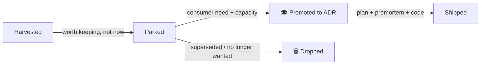

# Future Ideas

A parking lot for **harvested-but-deferred** engineering patterns. An idea lands here when it is
real and worth keeping, but is **not** scheduled for the current wave of work — typically because it
needs its own decision, a new package, or a concrete consumer before it earns a place on a roadmap.

This is deliberately **lighter than an ADR**: a Future Idea records *what* and *why-parked*, not a
committed decision. When an idea is picked up, it **graduates** into a numbered
[ADR](../adr/README.md) with an implementation plan + premortem, and its row here is marked
`🎓 Promoted`.

One idea = one file. Filenames follow `NNN-kebab-title.md`, monotonic numbering, no gaps.

## Index

| # | Title | Source | Would-be target | Effort | Status |
|---|---|---|---|---|---|
| FI-001 | [Outbound webhook delivery](001-outbound-webhooks.md) | [harvest wave 2](../production-harvest-second-app.md) (A4) | new `SolTechnology.Core.Webhooks` | M | ⏸️ Parked |
| FI-002 | [Priority background jobs — Hangfire flavour](002-priority-background-jobs-hangfire.md) | [harvest wave 2](../production-harvest-second-app.md) (C3) | `SolTechnology.Core.Hangfire` | M | ⏸️ Parked |

Status values: `⏸️ Parked` / `🎓 Promoted` (→ ADR) / `🗑️ Dropped`.

## Lifecycle

## How an idea graduates

1. A concrete consumer need appears (an app actually wants it).
2. Pick the next free `NNN` from the [ADR index](../adr/README.md) and open a new ADR.
3. Run the [`implementation-planning`](../../.github/skills/implementation-planning) agent to produce
   the numbered step files + the mandatory premortem gate.
4. Update this idea's **Status** to `🎓 Promoted` with a link to the ADR.

## Adding a new idea

- Pick the next free `FI-NNN` from the index above.
- Filename `NNN-kebab-title.md`. Required sections: Status, Context, Why parked, Sketch, Graduation triggers.
- Add a row to the index in the same change.

