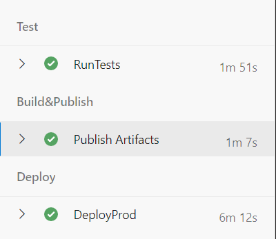
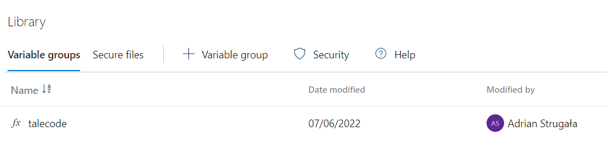

To give you the time to focus on the code, there is one important piece that has to be done right. And this is the infrastructure of your service.
The rules that I am following are:
1. Do your configuration only once
2. Automate everything
3. Hide the secrets
4. Have your pipeline always green:


## Infrastructure as a code

It's convenient to have the service infra written as a code. That enables all of the visibility and tracking of GitHub and ensures the repeatability and reliability of the deployments.

In the TaleCode app case, the Bicep (ARM Template overlay) was used: [Link](https://github.com/AdrianStrugala/SolTechnology.Core/blob/master/taleCode/devOps/infrastructure/main.bicep)

It contains following sections:
* appServicePlan (service farm)
  - api
  - backgroundWorker 
  - appSettings for each
* sql server
  * sql database  
* app insights
* storage account
* service bus

That's actually all what is needed to run the full app on Azure!


## Automated CI/CD

The same reasoning stays behind pipelines as a code. The pipeline needed for infra and apps deployment: [Link](https://github.com/AdrianStrugala/SolTechnology.Core/blob/master/taleCode/devOps/pipelines/pipeline.yml)

Is build of following steps:
- Test
  - Run Sql Server in local Docker
  - Deploy Database to local server
  - Run Unit Tests
  - Run Integration Tests
  - Run Component Tests
- Build
  - Publish Infra
  - Publish Database (dacpac)
  - Publish Api
  - Publish EventListener
  - Publish BackgroundWorker
- Deploy (multiply by number of environments)
  - Apply environment specific settings
  - Deploy Infrastructure (from Bicep file ^)
  - Deploy Database
  - Deploy Apps

Take a look at the benefits on this configuration:
1) **The app is tested by unit and integration tests**
2) **The database changes are tested**
3) **It's not dependend on external resources (what is needed is run locally)**


## Manage secrets

There is cool feature build in Azure DevOps that makes secrets management pleasure: Library


Using it is simple. By adding:
```
variables:
 - group: talecode
```

To pieline.yml file the variables can now be references as:
```
$(sqlAdminUserName)
```

What's even more cool, by applying json format, they can be applied directly to appsettings:
```
- task: FileTransform@1
    displayName: 'Apply Production App settings for Api'
    inputs:
    folderPath: '$(Build.ArtifactStagingDirectory)/**/*Api.zip'
    fileType: 'json'
    targetFiles: '**/appsettings.json'
```