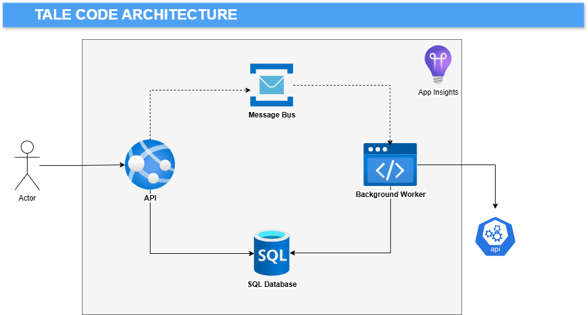
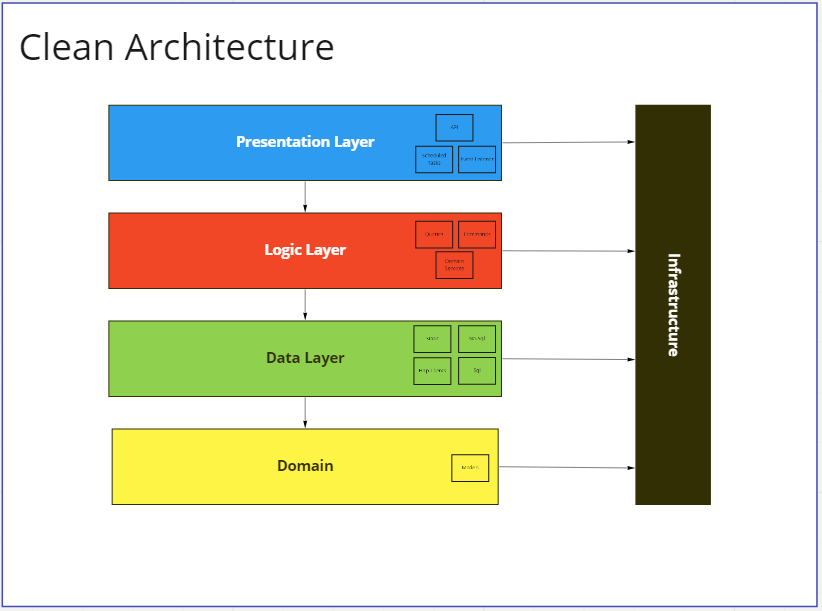
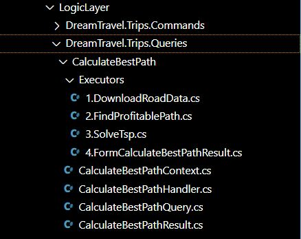
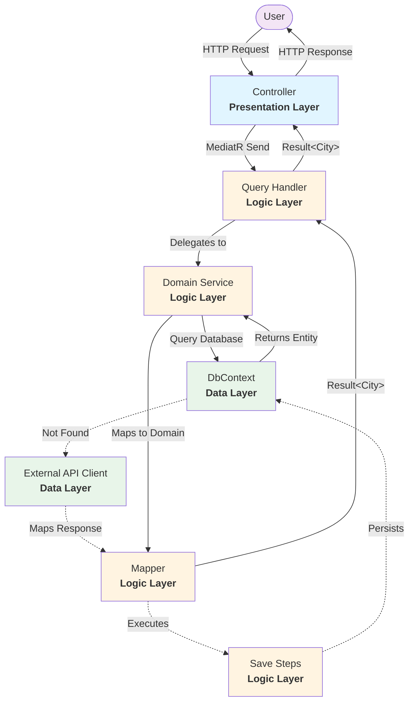
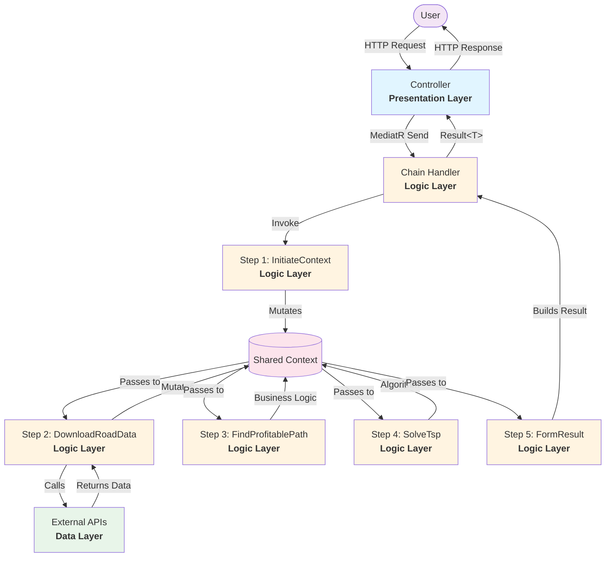
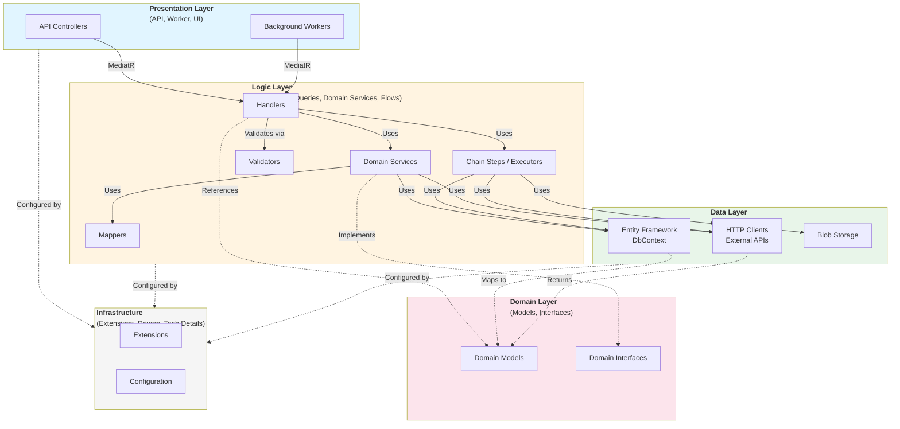
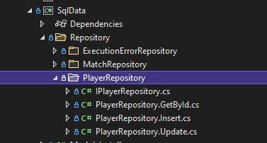

## Architecture





| Component  | Purpose  |   
|---|---|
| Background Worker  | Runs Commands on time/event/api trigger |     
| API                | Provides Queries for users  |   
| SQL Database       | Stores data in relational model  |   
| Service Bus        | Message Broker  |   
| External API       | Provides data needed by the Application  |   
| Application Insights  | Collects logs from all sources  |   


Application written in Tale Code uses the Clean Architecture approach. Projects are organized into layers with clear responsibilities and dependencies from top to bottom.

#### 1) Domain
The domain is the heart of the application. It identifies the area, bounded context, and common language between business and developers. The information is gathered into models understandable by every team member of the project.

#### 2) Data Layer
This layer is responsible for communication with data sources. The simplest use case would be a repository built on an SQL database or HTTP client. It may contain multiple projects dedicated to different types of sources.

#### 3) Logic Layer
The part for which stakeholders are paying. It contains only the pieces of code that bring business value. It does not care where the data comes from or where it ends. Its responsibility is to run all of the operations, calculations, commands, and queries required to achieve success. It might use CQRS, Domain Services, or Application approaches, whichever is the most extensible, natural, and understandable for the development team.

#### 4) Presentation Layer
The entry point or points for the application. API, triggers, scheduled tasks, event handlers - every way of making the application do something is considered as Presentation.

#### 5) Infrastructure
Everything else. Drivers, extensions, and the rest of the technical details needed to write a good piece of code.




## Code Design

### Presentation Layer

Starting from the top, Tale Code is organized in well-known and old-fashioned layers. The first and initial layer is the Presentation Layer.

This layer is responsible for communication with the outside world. It contains a minimum of code. Presentation is only a wrapper for the logic, containing all presentation-specific aspects (like authentication). In the sample app, it's built of 2 components:

#### BackgroundWorker

Subscribes to messages and invokes operations based on them. In this scenario, on CitySearched event invokes FetchCityDetails command:

```csharp
    public class FetchCityDetailsJob(IMediator mediator) : INotificationHandler<CitySearched>
    {
        public async Task Handle(CitySearched notification, CancellationToken cancellationToken)
        {
            await mediator.Send(new FetchCityDetailsCommand {Name = notification.Name}, cancellationToken);
        }
    }
```

#### Api

Provides a public interface for queries:

```csharp
    [Route(Route)]
    [ServiceFilter(typeof(ExceptionFilter))]
    [ServiceFilter(typeof(ResponseEnvelopeFilter))]
    public class FindCityByNameController(
        IMediator mediator,
        ILogger<FindCityByNameController> logger)
        : ControllerBase
    {
        public const string Route = "api/v2/FindCityByName";


        [HttpPost]
        [Produces(MediaTypeNames.Application.Json)]
        [ProducesResponseType(typeof(Result<City>), (int)HttpStatusCode.OK)]
        [ProducesResponseType(typeof(Result), (int)HttpStatusCode.BadRequest)]
        public async Task<IActionResult> FindCityByName([FromBody] FindCityByNameQuery query)
        {
            logger.LogInformation("Looking for city: " + query.Name);
            return Ok(await mediator.Send(query));
        }
    }
```


### Logic Layer

Contains all of the business knowledge and operations. Commands and Queries are separated from each other. They have totally different purposes, there is no reason to mix them. They can vary on everything, even on the technology used.

In DreamTravel, the LogicLayer is organized into several projects, each serving a specific purpose:

```
LogicLayer/
├── DreamTravel.DomainServices/       (Reusable business logic)
├── DreamTravel.Flows/                (Interactive workflows)
├── DreamTravel.Trips.Commands/       (Write operations)
└── DreamTravel.Trips.Queries/        (Read operations)
```

#### Commands

Commands are operations focused on data consistency. Execution time is not a crucial factor for commands, rather reliability. That's why I suggest following couple of simple rules:
1) Validate command input!
2) Ensure command could be retried
3) Ensure that no information is lost - data consistency and quality checks
4) Work on smart error handling - distinct between expected failure scenarios and exceptions
5) Log a lot, and have log scope


#### Queries

Queries are fundamentally different from commands. Crucial factor is the response time.
1) Be quick
2) No not rely on external services if possible
3) Use pre-generated read models
4) Be fast
5) Cache responses
6) Handle errors - fallbacks
7) Respond rapidly


#### Handlers Structure

The Tale Code approach organizes handlers into clear, readable flows. There are two main patterns used in DreamTravel:

**Simple Handlers** - for straightforward operations that delegate to DomainServices:

```csharp
public class FindCityByNameHandler(
    ICityDomainService cityDomainService,
    IHangfireNotificationPublisher notificationPublisher)
    : IQueryHandler<FindCityByNameQuery, City>
{
    public async Task<Result<City>> Handle(FindCityByNameQuery query, CancellationToken cancellationToken)
    {
        var result = await cityDomainService.Get(query.Name);
        notificationPublisher.Publish(new CitySearched { City = result });
        return result;
    }
}
```

**Chain Handlers** - for complex multi-step operations:

```csharp
public class CalculateBestPathHandler(IServiceProvider serviceProvider)
    : ChainHandler<CalculateBestPathQuery, CalculateBestPathContext, CalculateBestPathResult>(serviceProvider)
{
    protected override async Task HandleChain()
    {
        await Invoke<InitiateContext>();
        await Invoke<DownloadRoadData>();
        await Invoke<FindProfitablePath>();
        await Invoke<SolveTsp>();
        await Invoke<FormCalculateBestPathResult>();
    }
}
```

The repository is structured in this way:

```
LogicLayer/
├─ DreamTravel.Trips.Queries/
│  ├─ CalculateBestPath/
│  │  ├─ CalculateBestPathQuery.cs        (Input model with validation)
│  │  ├─ CalculateBestPathHandler.cs      (Orchestrator)
│  │  ├─ CalculateBestPathContext.cs      (Shared data for all steps)
│  │  ├─ CalculateBestPathResult.cs       (Output model)
│  │  ├─ Executors/
│  │  │  ├─ 0.InitiateContext.cs          (Step 1)
│  │  │  ├─ 1.DownloadRoadData.cs         (Step 2)
│  │  │  ├─ 2.FindProfitablePath.cs       (Step 3)
│  │  │  ├─ 3.SolveTsp.cs                 (Step 4)
│  │  │  ├─ 4.FormCalculateBestPathResult.cs (Step 5)
```

Where:

- **Query/Command** - Input anemic model with FluentValidation rules
- **Handler** - Orchestrates the flow, contains minimal code
- **Context** - Shared data structure passed through all executors
- **Result** - Output model returned to the caller
- **Executors** - Individual steps with single, clear purpose (numbered for ordering)

For maximum readability, Handler behaves like a table of contents. Each step is explicitly listed, making the business flow obvious from a glance. No hidden magic, no searching through inheritance chains - just a clear list of "what happens next."



#### DomainServices - The Reusable Business Logic

DomainServices are where the reusable pieces of domain logic live. Think of them as the operations you'd want to use from multiple handlers without copy-pasting code everywhere.

```csharp
public interface ICityDomainService
{
    Task<City> Get(string name, Action<CityReadOptions>? configureOptions = null);
    Task<City> Get(double latitude, double longitude, Action<CityReadOptions>? configureOptions = null);
    Task Save(City city);
}

public class CityDomainService(
    ICityMapper cityMapper,
    IAssignAlternativeNameStep assignAlternativeNameStep,
    IIncrementSearchCountStep incrementSearchCountStep,
    DreamTripsDbContext dbContext,
    IGoogleApiClient googleApiClient)
    : ICityDomainService
{
    public async Task<City> Get(string name, Action<CityReadOptions>? configureOptions = null)
    {
        var options = new CityReadOptions();
        configureOptions?.Invoke(options);

        // Try database first
        var entity = await dbContext.Cities
            .Include(c => c.AlternativeNames)
            .Include(c => c.Statistics)
            .FirstOrDefaultAsync(c => c.AlternativeNames.Any(an => an.AlternativeName == name));

        if (entity != null)
        {
            return cityMapper.ToDomain(entity, options, name);
        }

        // Fallback to external API
        var cityFromApi = await googleApiClient.GetLocationOfCity(name);
        await Save(cityFromApi);

        return cityFromApi;
    }

    public async Task Save(City city)
    {
        var entity = await dbContext.Cities
            .Include(c => c.AlternativeNames)
            .Include(c => c.Statistics)
            .FirstOrDefaultAsync(c => c.Latitude == city.Latitude && c.Longitude == city.Longitude);

        entity = cityMapper.ApplyUpdate(entity, city);

        // Execute save steps
        assignAlternativeNameStep.Invoke(entity, city.Name);
        incrementSearchCountStep.Invoke(entity, DateOnly.FromDateTime(DateTime.UtcNow));

        if (entity.Id == default)
        {
            await dbContext.Cities.AddAsync(entity);
        }

        await dbContext.SaveChangesAsync();
    }
}
```

**What's happening here?**
- DomainService abstracts data access (EF Core) and external APIs (Google)
- Provides a clean interface for handlers to work with
- Coordinates mappers and save steps
- Implements fallback logic (database → external API)
- Allows customization via `CityReadOptions`

#### ReadOptions - Load What You Need, Skip What You Don't

Here's a common performance problem: City might have 2137 streets in the database. Do you really need to load all of them just to add an alternative name to the city? Probably not. That's where ReadOptions come in.

ReadOptions is a pattern for selective data loading. Instead of always loading everything (N+1 query nightmare), or never loading anything (missing data errors), you let the caller decide what they need:

```csharp
public class CityReadOptions
{
    public bool IncludeStreets { get; set; }
    public bool IncludeStatistics { get; set; }
    public bool IncludePoints { get; set; }
}
```

The DomainService accepts a configuration action:

```csharp
public async Task<City> Get(string name, Action<CityReadOptions>? configureOptions = null)
{
    var options = new CityReadOptions();
    configureOptions?.Invoke(options);

    // Build query based on options
    var query = dbContext.Cities.AsQueryable();

    query = query.Include(c => c.AlternativeNames);  // Always needed

    if (options.IncludeStreets)
        query = query.Include(c => c.Streets);       // Only if requested

    if (options.IncludeStatistics)
        query = query.Include(c => c.Statistics);    // Only if requested

    if (options.IncludePoints)
        query = query.Include(c => c.Points);        // Only if requested

    var entity = await query.FirstOrDefaultAsync(c => c.AlternativeNames.Any(an => an.AlternativeName == name));

    return cityMapper.ToDomain(entity, options, name);
}
```

And the Mapper uses the same options to decide what to map:

```csharp
public City ToDomain(CityEntity entity, CityReadOptions options, string? requestedName = null)
{
    var city = new City
    {
        Name = requestedName ?? entity.AlternativeNames.FirstOrDefault()?.AlternativeName,
        Latitude = entity.Latitude,
        Longitude = entity.Longitude
    };

    // Conditionally map based on what was loaded
    if (options.IncludeStatistics && entity.Statistics.Any())
    {
        city.SearchStatistics = entity.Statistics
            .Select(s => new CitySearchStatistics { Date = s.Date, SearchCount = s.SearchCount })
            .ToList();
    }

    if (options.IncludeStreets && entity.Streets.Any())
    {
        city.Streets = entity.Streets
            .Select(s => new Street { Name = s.Name, Length = s.Length })
            .ToList();
    }

    return city;
}
```

**Usage in handlers:**

```csharp
// Simple case - no heavy collections needed
var city = await cityDomainService.Get("Warsaw");

// Need statistics for analytics
var cityWithStats = await cityDomainService.Get("Warsaw", opts =>
{
    opts.IncludeStatistics = true;
});

// Need everything for detailed view
var cityFull = await cityDomainService.Get("Warsaw", opts =>
{
    opts.IncludeStatistics = true;
    opts.IncludeStreets = true;
    opts.IncludePoints = true;
});
```

**Why this pattern?**
- **Performance**: Load only what you need. Adding alternative name? Skip 2137 streets.
- **Flexibility**: Each handler decides its own data requirements
- **Explicit**: No hidden "lazy loading" surprises - you see exactly what's being loaded
- **Type-safe**: Compiler checks your options, no magic strings
- **Testable**: Easy to verify what data is loaded in unit tests

This beats the alternatives:
- ❌ Always load everything → slow, memory-heavy
- ❌ Never load anything → missing data errors, manual loading everywhere
- ❌ Lazy loading → hidden queries, hard to debug, doesn't work with detached entities
- ✅ ReadOptions → explicit, performant, flexible

#### Mappers - Converting Between Layers

Mappers handle the translation between database entities and domain models. They're manual, explicit, and straightforward:

```csharp
public interface ICityMapper
{
    City ToDomain(CityEntity entity, CityReadOptions options, string? name = null);
    CityEntity ApplyUpdate(CityEntity? entity, City city);
}

public class CityMapper : ICityMapper
{
    public City ToDomain(CityEntity entity, CityReadOptions options, string? requestedName = null)
    {
        var cityName = requestedName
                       ?? entity.AlternativeNames.FirstOrDefault()?.AlternativeName
                       ?? throw new InvalidOperationException("City has no name");

        var city = new City
        {
            Name = cityName,
            Latitude = entity.Latitude,
            Longitude = entity.Longitude,
            Country = entity.Country
        };

        // Conditionally map statistics if they exist
        if (entity.Statistics.Any())
        {
            city.SearchStatistics = entity.Statistics
                .Select(s => new CitySearchStatistics
                {
                    Date = s.Date,
                    SearchCount = s.SearchCount
                })
                .ToList();
        }

        return city;
    }

    public CityEntity ApplyUpdate(CityEntity? entity, City city)
    {
        if (entity == null)
        {
            return new CityEntity
            {
                CityId = Guid.NewGuid(),
                Latitude = city.Latitude,
                Longitude = city.Longitude,
                Country = city.Country
            };
        }

        entity.Latitude = city.Latitude;
        entity.Longitude = city.Longitude;
        entity.Country = city.Country;

        return entity;
    }
}
```

**Why manual mappers?**
- Explicit code is easier to debug and understand
- No reflection overhead
- Refactoring tools work perfectly (rename property = compiler finds all usages)
- Business logic can live in mapping (like alternative name fallback)
- Aligns with Tale Code philosophy - code should read like prose, not magic

#### SaveSteps - Sequential Operations

SaveSteps are small, focused operations that run during persistence. They follow the Single Responsibility Principle to an extreme:

**1.AssignAlternativeNameStep.cs**
```csharp
public interface IAssignAlternativeNameStep
{
    void Invoke(CityEntity cityEntity, string name);
}

public class AssignAlternativeNameStep : IAssignAlternativeNameStep
{
    public void Invoke(CityEntity cityEntity, string name)
    {
        var exists = cityEntity.AlternativeNames
            .Any(an => an.AlternativeName.Equals(name, StringComparison.OrdinalIgnoreCase));

        if (exists) return;

        cityEntity.AlternativeNames.Add(new AlternativeNameEntity
        {
            AlternativeName = name,
            City = cityEntity
        });
    }
}
```

**2.IncrementSearchCountStep.cs**
```csharp
public interface IIncrementSearchCountStep
{
    void Invoke(CityEntity cityEntity, DateOnly date);
}

public class IncrementSearchCountStep : IIncrementSearchCountStep
{
    public void Invoke(CityEntity cityEntity, DateOnly date)
    {
        var statistics = cityEntity.Statistics
            .FirstOrDefault(s => s.City.Id == cityEntity.Id && s.Date == date);

        if (statistics != null)
        {
            statistics.SearchCount++;
            return;
        }

        cityEntity.Statistics.Add(new CityStatisticsEntity
        {
            Date = date,
            SearchCount = 1
        });
    }
}
```

Files are numbered (`1.`, `2.`) to make the execution order obvious. Each step has a single `Invoke` method that modifies the entity. The DomainService calls them in sequence before saving to the database.

#### How It All Fits Together

Here's a visual representation of how a typical query flows through the system:

##### Simple Query Flow



##### Complex Query Flow (ChainHandler)



##### Layer Dependencies Overview



**Flow Principles:**

Each executor/step receives a `Context` object, mutates it, and returns `Result.Success()` or `Result.Fail()`. The handler stops on first failure.

**Dependency Rules:**
- Dependencies flow **downward only**: Presentation → Logic → Data → Infrastructure
- Domain has **no dependencies** on other layers
- Each layer can only reference layers below it
- Never reference higher layers from lower layers

#### Pattern Decision Matrix

Not every operation needs the full DomainService + Steps treatment. Here's when to use what:

| Scenario | Recommended Pattern | Example |
|----------|---------------------|---------|
| Simple read without business logic | Direct DbContext + Projection in Handler | Get all cities from DB |
| Read with reusable business logic | DomainService | Find city (DB → fallback to API) |
| Complex multi-step query | ChainHandler + Executors | Calculate best path with TSP |
| Simple write operation | Direct handler with DbContext | Update city name |
| Complex write operation | ChainHandler + Steps | Multi-step data processing |
| Reusable write logic | DomainService + SaveSteps | Save city with alternatives |
| Interactive user workflow | PausableChainHandler + Flow | Order processing with user input |

The key is to use the simplest pattern that solves your problem. Don't reach for ChainHandler if a simple handler will do. Don't create DomainService if the logic is used in only one place. Keep it readable, keep it simple.


### Data Layer

Encapsulates all of the code needed for external components or services integration.

#### ApiClients

External API clients:

```csharp
    public partial class GoogleApiClient : IGoogleApiClient
    {
        private readonly GoogleApiOptions _options;
        private readonly ILogger<GoogleApiClient> _logger;
        private readonly HttpClient _httpClient;

        public GoogleApiClient(IOptions<GoogleApiOptions> options, HttpClient httpClient, ILogger<GoogleApiClient> logger)
        {
            _options = options.Value;
            _httpClient = httpClient;
            _logger = logger;
        }

        public async Task<City> GetLocationOfCity(string cityName)
        {
            try
            {
                City result = new City { Name = cityName };

                var request = await _httpClient
                    .CreateRequest($"maps/api/geocode/json?address={cityName}&key={_options.Key}")
                    .GetAsync();

                var response = await request.Content.ReadAsStringAsync();
                JObject json = JObject.Parse(response);

                result.Latitude = json["results"][0]["geometry"]["location"]["lat"].Value<double>();
                result.Longitude = json["results"][0]["geometry"]["location"]["lng"].Value<double>();
                return result;
            }

            catch (Exception)
            {
                throw new InvalidDataException($"Cannot find city [{cityName}]");
            }
        }
    }
```

#### SqlData

SQL repositiories and queries:


```csharp
    public partial class PlayerRepository : IPlayerRepository
    {
        private readonly ISqlConnectionFactory _sqlConnectionFactory;

        public PlayerRepository(ISqlConnectionFactory sqlConnectionFactory)
        {
            _sqlConnectionFactory = sqlConnectionFactory;
        }


        private const string InsertSql = @"
  INSERT INTO [dbo].[Player] (
    [ApiId],
	[Name],
	[DateOfBirth],
    [Nationality],
	[Position])
VALUES (@ApiId, @Name, @DateOfBirth, @Nationality, @Position)
";

        public void Insert(Player player)
        {
            using (var connection = _sqlConnectionFactory.CreateConnection())
            {
                var transaction = connection.BeginTransaction();

                connection.Execute(InsertSql, new
                {
                    ApiId = player.ApiId,
                    Name = player.Name,
                    DateOfBirth = player.DateOfBirth,
                    Nationality = player.Nationality,
                    Position = player.Position
                }, transaction);


                connection.Insert<Team>(player.Teams, transaction);

                transaction.Commit();
            }

        }
    }
```

What is worth to mention here. in purpose of keeping classes small and readabe, the adventage of partial classes can be used:




#### BlobData

Methods for Blob Storage read/write operations:


```csharp
    public class PlayerStatisticsRepository : IPlayerStatisticsRepository
    {
        private const string ContainerName = "playerstatistics";

        private readonly BlobContainerClient _client;

        public PlayerStatisticsRepository(IBlobConnectionFactory blobConnectionFactory)
        {
            _client = blobConnectionFactory.CreateConnection(ContainerName);
        }

        public async Task Add(PlayerStatistics playerStatistics)
        {
            await _client.WriteToBlob(playerStatistics.Id.ToString(), playerStatistics);
        }

        public async Task<PlayerStatistics> Get(int playerId)
        {
            var result = await _client.ReadFromBlob<PlayerStatistics>(playerId.ToString());

            return result;
        }
    }
```

#### StaticData

Contains data not changing in time.
