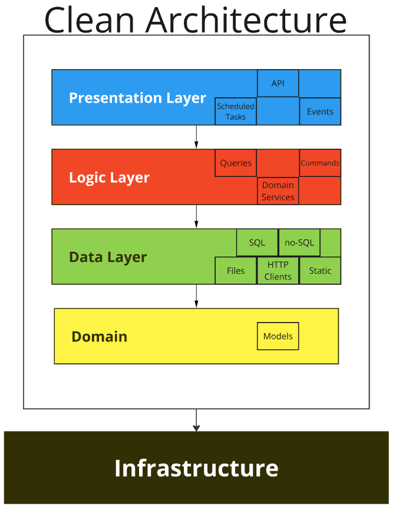
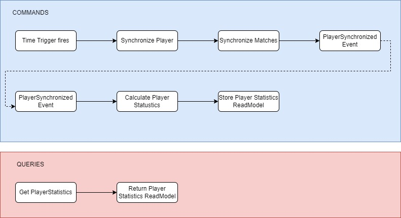

## Architecture



Tale Code application is using Clean Architecture approach as on above picture. Projects are ogranized into layers with clear responsibilities and dependencies from top to bottom.

#### 1) Domain
The domain is heart of the application. Identyfies the area, bounded context and common language between business and developers. The information is gathered into models understanable by every team member of the project.

#### 2) Data Layer
This layer is responsible for communication with storages. The most simple use case would be Repository build on SQL or no-SQL databse. May contain multiple projects dedicated to different types of storages. 

#### 3) Logic Layer
The part for which stakeholders are paying for. Contains only the pieces of codes that brings business value. It does not care from where the data comes from or where it ends. It's responsibility is to run all of the operations, calculations, commands and queries required to achieve success. \
Might be using CQRS or Domain Services or Application approaches. Whatever is the most extensible, natural and understandable for the development team.

#### 4) Presentation Layer
The entry point or points for the applciation. API, triggers, scheduled tasks, event handlers - every way of making the application to do something is considered as Presentation.

#### 5) Infrastructure
Everything else. Drivers, extensions and rest of techincal details needed to write good piece of code.


Tale Code application is build of following components:

| Component  | Purpose  |   
|---|---|
| Background Worker  | Runs Commands on internal triggers time|event|api  |     
| API                | Provides Queries for users  |   
| SQL Database       | Stores data in relational model  |   
| Blob Storage       | Stores read models for Queries  |   
| Service Bus        | Message Broker  |   
| External API       | Provides data needed by the Application  |   
| Application Insights  | Collects logs from all sources  |   


## Code Design

Extending the Readme example:

```csharp
        await Chain
            .Start(() => GetPlayerId(command.PlayerId))
            .Then(SynchronizePlayer)
            .Then(CalculateMatchesToSync)
            .Then(match => match.ForEach(id =>
                SynchronizeMatch(id, command.PlayerId)))
            .Then(_ => new PlayerMatchesSynchronizedEvent(command.PlayerId))
            .Then(PublishMessage)
            .EndCommand();
```

### Command Handler Structure

The repository is structurized in this way:


Where:

- Handler is already known to you - this is the business logic part
- Command is an input anemic model
- Event is an output of the operation (in this case)
- Context holds the data needed for the whole operation. It is shared between Handler and Executors
- Executors are steps needed for fulfilling the business logic. They have a single and clear purpose

For maximum readability Handler behaves like an orchestrator. It calls the executors in needed order and produces the final result. The code is clear from the solution view and from the editor itself.


### Presentation Layer

From detail, to the general. Tale Code is organized in well-known and old-fashioned layers. The first and initial is a Presentation Layer.

This Layer is responsible for communication with the outside world. It conains minumum of the code. Presentation is only a wrapper for the logic, conataining all presentation-specific aspecs (like authenticaion) though. It is build of 3 components:

#### BackgroundWorker

Runs scheduled jobs:

```csharp
    public class SynchornizeCristianoRonaldoMatches : ScheduledJob
    {
        private readonly ICommandHandler<SynchronizePlayerMatchesCommand> _handler;

        public SynchornizeCristianoRonaldoMatches(
            ISchedulerConfigurationProvider schedulerConfigurationProvider,
            IServiceScopeFactory serviceScopeFactory,
            ILogger<ScheduledJob> logger)
            : base(schedulerConfigurationProvider, serviceScopeFactory, logger)
        {
            var scope = serviceScopeFactory.CreateScope();
            var handler = scope.ServiceProvider.GetRequiredService<ICommandHandler<SynchronizePlayerMatchesCommand>>();
            _handler = handler;
        }

        public override async Task Execute()
        {
            await _handler.Handle(new SynchronizePlayerMatchesCommand(44));
        }
    }
```

Subscribes to messages and invokes operations based on them:

```csharp
    public class CalculatePlayerStatistics : IMessageHandler<PlayerMatchesSynchronizedEvent>
    {
        private readonly ICommandHandler<CalculatePlayerStatisticsCommand> _handler;

        public CalculatePlayerStatistics(ICommandHandler<CalculatePlayerStatisticsCommand> handler)
        {
            _handler = handler;
        }

        public async Task Handle(PlayerMatchesSynchronizedEvent message, CancellationToken cancellationToken)
        {
            var command = new CalculatePlayerStatisticsCommand(message.PlayerId);
            await _handler.Handle(command);
        }
    }
```

#### Api

Provides a public interface for queries:

```csharp
    public class GetPlayerStatisticsController : ControllerBase
    {
        private readonly IQueryHandler<GetPlayerStatisticsQuery, GetPlayerStatisticsResult> _handler;

        public GetPlayerStatisticsController(IQueryHandler<GetPlayerStatisticsQuery, GetPlayerStatisticsResult> handler)
        {
            _handler = handler;
        }

        [HttpGet]
        [Route("GetPlayerStatistics/{playerId}")]
        public async Task<GetPlayerStatisticsResult> GetPlayerStatistics(int playerId)
        {
            try
            {
                return await _handler.Handle(new GetPlayerStatisticsQuery(playerId));
            }
            catch (Exception e)
            {
                Console.WriteLine(e);
                throw;
            }
        }
    }
```

### Logic Layer

Contains all of the business knowledge and operations. Commands and Queries are separated from each other. They have totally different purposes, there is no reason to mix them. They can vary on everything, even on the technology used.

#### Commands

Commands are operations focused on data consistency. They are composed from few steps:
1) Trigger - usually coming from outside of the application (time trigger, event handler, queue message, API call)
2) Get the external data
3) Validate!
4) Adjust to a specific application or domain - map, modify, combine
5) Store in persistent storage
6) Ensure that no item is lost - data consistency and quality checks
7) Pre-generate read models for crucial queries (SQL Materialized View, Temporary Storage (ex. No-Sql database)

```csharp
    public class SynchronizePlayerMatchesHandler : ICommandHandler<SynchronizePlayerMatchesCommand>
    {
        private Func<int, PlayerIdMap> GetPlayerId { get; }
        private Func<IMessage, Task> PublishMessage { get; }
        private Func<int, int, Task> SynchronizeMatch { get; }
        private Func<Player, List<int>> CalculateMatchesToSync { get; }
        private Func<PlayerIdMap, Task<Player>> SynchronizePlayer { get; }

        public SynchronizePlayerMatchesHandler(
            ISyncPlayer syncPlayer,
            IDetermineMatchesToSync determineMatchesToSync,
            ISyncMatch syncMatch,
            IPlayerExternalIdsProvider playerExternalIdsProvider,
            IMessagePublisher messagePublisher)
        {
            GetPlayerId = playerExternalIdsProvider.Get;
            SynchronizePlayer = syncPlayer.Execute;
            CalculateMatchesToSync = determineMatchesToSync.Execute;
            SynchronizeMatch = syncMatch.Execute;
            PublishMessage = messagePublisher.Publish;
        }

        public async Task Handle(SynchronizePlayerMatchesCommand command)
        {
            await Chain
                .Start(() => GetPlayerId(command.PlayerId))
                .Then(SynchronizePlayer)
                .Then(CalculateMatchesToSync)
                .Then(match => match.ForEach(id =>
                    SynchronizeMatch(id, command.PlayerId)))
                .Then(_ => new PlayerMatchesSynchronizedEvent(command.PlayerId))
                .Then(PublishMessage)
                .EndCommand();
        }
    }
```

#### Queries

Queries are fundamentally different from commands. Crucial factor is the response time.
1) Be quick
2) No not rely on external services if possible
3) Use pre-generated read models
4) Be fast
5) Cache responses
6) Handle errors - fallbacks
7) Respond rapidly


```csharp
    public class GetPlayerStatisticsHandler : IQueryHandler<GetPlayerStatisticsQuery, GetPlayerStatisticsResult>
    {
        private readonly IPlayerStatisticsRepository _playerStatisticsRepository;

        public GetPlayerStatisticsHandler(IPlayerStatisticsRepository playerStatisticsRepository)
        {
            _playerStatisticsRepository = playerStatisticsRepository;
        }

        public async Task<GetPlayerStatisticsResult> Handle(GetPlayerStatisticsQuery query)
        {
            var data = await _playerStatisticsRepository.Get(query.PlayerId);

            var result = new GetPlayerStatisticsResult
            {
                Id = data.Id,
                Name = data.Name,
                NumberOfMatches = data.NumberOfMatches,
                StatisticsByTeams = data.StatisticsByTeams.Select(s => new StatisticsByTeam
                {
                    DateFrom = s.DateFrom,
                    DateTo = s.DateTo,
                    NumberOfMatches = s.NumberOfMatches,
                    PercentageOfMatchesResultingCompetitionVictory = s.PercentageOfMatchesResultingCompetitionVictory,
                    TeamName = s.TeamName
                }).ToList()
            };

            return result;
        }
    }
```

### Data Layer

Encapsulates all of the code needed for external components or services integration.

#### ApiClients

External API clients:

```csharp
   public class FootballDataApiClient : IFootballDataApiClient
    {
        private readonly HttpClient _httpClient;

        public FootballDataApiClient(HttpClient httpClient)
        {
            _httpClient = httpClient;
        }

        public async Task<FootballDataPlayer> GetPlayerById(int id)
        {
            var apiResult = await _httpClient.GetAsync<PlayerModel>($"v2/players/{id}/matches?limit=999");

            var result = new FootballDataPlayer
            {
                Id = apiResult.Player.Id,
                Name = apiResult.Player.Name,
                DateOfBirth = apiResult.Player.DateOfBirth,
                Nationality = apiResult.Player.Nationality,
                Position = apiResult.Player.Position,
                Matches = apiResult.Matches.OrderBy(m => m.UtcDate).Select(m => new FootballDataMatch
                {
                    Id = m.Id,
                    Date = m.UtcDate,
                    HomeTeam = m.HomeTeam.Name,
                    AwayTeam = m.AwayTeam.Name,
                    HomeTeamScore = m.Score.FullTime.HomeTeam,
                    AwayTeamScore = m.Score.FullTime.AwayTeam,
                    Winner = GetWinner(m)
                }).ToList()
            };

            return result;
        }
    }
```

#### SqlData

SQL repositiories and queries:


```csharp
    public partial class PlayerRepository : IPlayerRepository
    {
        private readonly ISqlConnectionFactory _sqlConnectionFactory;

        public PlayerRepository(ISqlConnectionFactory sqlConnectionFactory)
        {
            _sqlConnectionFactory = sqlConnectionFactory;
        }


        private const string InsertSql = @"
  INSERT INTO [dbo].[Player] (
    [ApiId],
	[Name],
	[DateOfBirth],
    [Nationality],
	[Position])
VALUES (@ApiId, @Name, @DateOfBirth, @Nationality, @Position)
";

        public void Insert(Player player)
        {
            using (var connection = _sqlConnectionFactory.CreateConnection())
            {
                var transaction = connection.BeginTransaction();

                connection.Execute(InsertSql, new
                {
                    ApiId = player.ApiId,
                    Name = player.Name,
                    DateOfBirth = player.DateOfBirth,
                    Nationality = player.Nationality,
                    Position = player.Position
                }, transaction);


                connection.Insert<Team>(player.Teams, transaction);

                transaction.Commit();
            }

        }
    }
```

What is worth to mention here. in purpose of keeping classes small and readabe, the adventage of partial classes can be used:


#### BlobData

Methods for Blob Storage read/write operations:


```csharp
    public class PlayerStatisticsRepository : IPlayerStatisticsRepository
    {
        private const string ContainerName = "playerstatistics";

        private readonly BlobContainerClient _client;

        public PlayerStatisticsRepository(IBlobConnectionFactory blobConnectionFactory)
        {
            _client = blobConnectionFactory.CreateConnection(ContainerName);
        }

        public async Task Add(PlayerStatistics playerStatistics)
        {
            await _client.WriteToBlob(playerStatistics.Id.ToString(), playerStatistics);
        }

        public async Task<PlayerStatistics> Get(int playerId)
        {
            var result = await _client.ReadFromBlob<PlayerStatistics>(playerId.ToString());

            return result;
        }
    }
```

#### StaticData

Contains data not changing in time.


## Command & Query Flow





Synchronize player steps:

a) get playerIds from static map

b) get matches of player by player id
http://api.football-data.org/v2/players/44/matches?limit=999

c) get player teams
https://api-football-v1.p.rapidapi.com/v3/transfers?player={apiId}

d) insert or update player

e) determine matches to sync (exclude already imported or failed)

f) get match details by match id
https://api.football-data.org/v2/matches/327130

g) assign competition winner

h) store match result

i) in case of not assigned winner - store execution error with match Id

j) publish PlayerMatchesSynchronizedEvent
