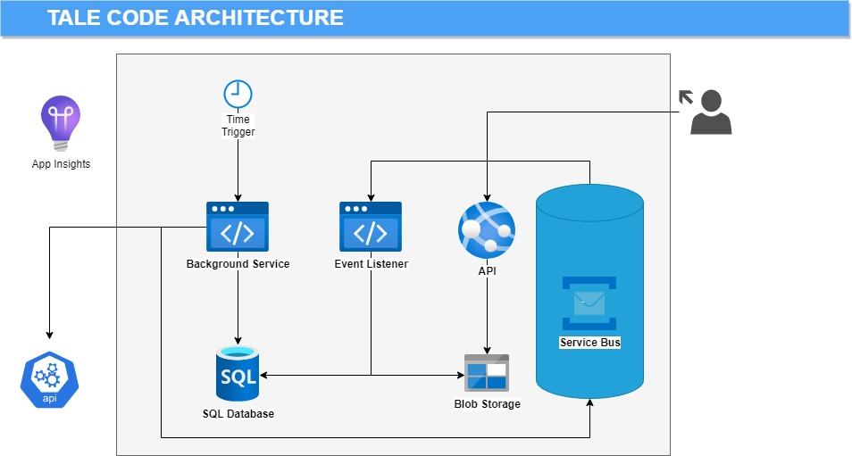

## Architecture




Tale Code application is build of following components:

| Component  | Purpose  |   
|---|---|
| Background Worker  | Runs Commands on time trigger  |   
| Event Listener     | Runs Commands on message triggers  |   
| API                | Provides Queries for users  |   
| SQL Database       | Stores data in relational model  |   
| Blob Storage       | Stores read models for Queries  |   
| Service Bus        | Message Broker  |   
| External API       | Provides data needed by the Application  |   
| Application Insights  | Collects logs from all sources  |   


## Code Design

Extending the Readme example:

```csharp
    public async Task Handle(SynchronizePlayerMatchesCommand command)
    {
        var playerIdMap = _playerExternalIdsProvider.GetExternalPlayerId(command.PlayerId);
        var context = new SynchronizePlayerMatchesContext
        {
            PlayerIdMap = playerIdMap
        };


        await _syncPlayer.Execute(context);

        _determineMatchesToSync.Execute(context);


        foreach (var matchId in context.MatchesToSync)
        {
            await _syncMatch.Execute(context, matchId);
        }

        var message = new PlayerMatchesSynchronizedEvent(command.PlayerId);
        await _messagePublisher.Publish(message);
    }
```

### Command Handler Structure

The repository is structurized in this way:


Where:

- Handler is already known to you - this is the business logic part
- Command is an input anemic model
- Event is an output of the operation (in this case)
- Context holds the data needed for the whole operation. It is shared between Handler and Executors
- Executors are steps needed for fulfilling the business logic. They have a single and clear purpose

For maximum readability Handler behaves like an orchestrator. It calls the executors in needed order and produces the final result. The code is clear from the solution view and from the editor itself.


### Presentation Layer

From detail, to the general. Tale Code is organized in well-known and old-fashioned layers. The first and initial is a Presentation Layer.

This Layer is responsible for communication with the outside world. It conains minumum of the code. Presentation is only a wrapper for the logic, conataining all presentation-specific aspecs (like authenticaion) though. It is build of 3 components:

#### BackgroundWorker

Runs scheduled jobs:

```csharp
    public class SynchornizeCristianoRonaldoMatches : ScheduledJob
    {
        private readonly ICommandHandler<SynchronizePlayerMatchesCommand> _handler;

        public SynchornizeCristianoRonaldoMatches(
            ISchedulerConfigurationProvider schedulerConfigurationProvider,
            IServiceScopeFactory serviceScopeFactory,
            ILogger<ScheduledJob> logger)
            : base(schedulerConfigurationProvider, serviceScopeFactory, logger)
        {
            var scope = serviceScopeFactory.CreateScope();
            var handler = scope.ServiceProvider.GetRequiredService<ICommandHandler<SynchronizePlayerMatchesCommand>>();
            _handler = handler;
        }

        public override async Task Execute()
        {
            await _handler.Handle(new SynchronizePlayerMatchesCommand(44));
        }
    }
```

#### EventListener

Subscribes to messages and invokes operations based on them:

```csharp
    public class CalculatePlayerStatistics : IMessageHandler<PlayerMatchesSynchronizedEvent>
    {
        private readonly ICommandHandler<CalculatePlayerStatisticsCommand> _handler;

        public CalculatePlayerStatistics(ICommandHandler<CalculatePlayerStatisticsCommand> handler)
        {
            _handler = handler;
        }

        public async Task Handle(PlayerMatchesSynchronizedEvent message, CancellationToken cancellationToken)
        {
            var command = new CalculatePlayerStatisticsCommand(message.PlayerId);
            await _handler.Handle(command);
        }
    }
```

#### Api

Provides an interface for queries:

```csharp
    public class GetPlayerStatisticsController : ControllerBase
    {
        private readonly IQueryHandler<GetPlayerStatisticsQuery, GetPlayerStatisticsResult> _handler;

        public GetPlayerStatisticsController(IQueryHandler<GetPlayerStatisticsQuery, GetPlayerStatisticsResult> handler)
        {
            _handler = handler;
        }

        [HttpGet]
        [Route("GetPlayerStatistics/{playerId}")]
        public async Task<GetPlayerStatisticsResult> GetPlayerStatistics(int playerId)
        {
            try
            {
                return await _handler.Handle(new GetPlayerStatisticsQuery(playerId));
            }
            catch (Exception e)
            {
                Console.WriteLine(e);
                throw;
            }
        }
    }
```

### Logic Layer

Contains all of the business knowledge and operations. Commands and Queries are separated from each other. They have totally different purposes, there is no reason to mix them. They can vary on everything, even on the technology used.

#### Commands

Commands are operations that fetches external data, manipulate it, and modifies. The most important is data consistency. The same example as above:

```csharp
    public class SynchronizePlayerMatchesHandler : ICommandHandler<SynchronizePlayerMatchesCommand>
    {
        private readonly ISyncPlayer _syncPlayer;
        private readonly IDetermineMatchesToSync _determineMatchesToSync;
        private readonly ISyncMatch _syncMatch;
        private readonly IPlayerExternalIdsProvider _playerExternalIdsProvider;
        private readonly IMessagePublisher _messagePublisher;

        public SynchronizePlayerMatchesHandler(
            ISyncPlayer syncPlayer,
            IDetermineMatchesToSync determineMatchesToSync,
            ISyncMatch syncMatch,
            IPlayerExternalIdsProvider playerExternalIdsProvider,
            IMessagePublisher messagePublisher)
        {
            _syncPlayer = syncPlayer;
            _determineMatchesToSync = determineMatchesToSync;
            _syncMatch = syncMatch;
            _playerExternalIdsProvider = playerExternalIdsProvider;
            _messagePublisher = messagePublisher;
        }

        public async Task Handle(SynchronizePlayerMatchesCommand command)
        {
            var playerIdMap = _playerExternalIdsProvider.GetExternalPlayerId(command.PlayerId);
            var context = new SynchronizePlayerMatchesContext
            {
                PlayerIdMap = playerIdMap
            };


            await _syncPlayer.Execute(context);

            _determineMatchesToSync.Execute(context);


            foreach (var matchId in context.MatchesToSync)
            {
                await _syncMatch.Execute(context, matchId);
            }

            var message = new PlayerMatchesSynchronizedEvent(command.PlayerId);
            await _messagePublisher.Publish(message);
        }
    }
```

#### Queries

Runs operations returning data to the users from data storage. Crucial factor here is the response time.


```csharp
    public class GetPlayerStatisticsHandler : IQueryHandler<GetPlayerStatisticsQuery, GetPlayerStatisticsResult>
    {
        private readonly IPlayerStatisticsRepository _playerStatisticsRepository;

        public GetPlayerStatisticsHandler(IPlayerStatisticsRepository playerStatisticsRepository)
        {
            _playerStatisticsRepository = playerStatisticsRepository;
        }

        public async Task<GetPlayerStatisticsResult> Handle(GetPlayerStatisticsQuery query)
        {
            var data = await _playerStatisticsRepository.Get(query.PlayerId);

            var result = new GetPlayerStatisticsResult
            {
                Id = data.Id,
                Name = data.Name,
                NumberOfMatches = data.NumberOfMatches,
                StatisticsByTeams = data.StatisticsByTeams.Select(s => new StatisticsByTeam
                {
                    DateFrom = s.DateFrom,
                    DateTo = s.DateTo,
                    NumberOfMatches = s.NumberOfMatches,
                    PercentageOfMatchesResultingCompetitionVictory = s.PercentageOfMatchesResultingCompetitionVictory,
                    TeamName = s.TeamName
                }).ToList()
            };

            return result;
        }
    }
```

### Data Layer

Encapsulates all of the code needed for external components or services integration.

#### ApiClients

External API clients:

```csharp
   public class FootballDataApiClient : IFootballDataApiClient
    {
        private readonly HttpClient _httpClient;

        public FootballDataApiClient(HttpClient httpClient)
        {
            _httpClient = httpClient;
        }

        public async Task<FootballDataPlayer> GetPlayerById(int id)
        {
            var apiResult = await _httpClient.GetAsync<PlayerModel>($"v2/players/{id}/matches?limit=999");

            var result = new FootballDataPlayer
            {
                Id = apiResult.Player.Id,
                Name = apiResult.Player.Name,
                DateOfBirth = apiResult.Player.DateOfBirth,
                Nationality = apiResult.Player.Nationality,
                Position = apiResult.Player.Position,
                Matches = apiResult.Matches.OrderBy(m => m.UtcDate).Select(m => new FootballDataMatch
                {
                    Id = m.Id,
                    Date = m.UtcDate,
                    HomeTeam = m.HomeTeam.Name,
                    AwayTeam = m.AwayTeam.Name,
                    HomeTeamScore = m.Score.FullTime.HomeTeam,
                    AwayTeamScore = m.Score.FullTime.AwayTeam,
                    Winner = GetWinner(m)
                }).ToList()
            };

            return result;
        }
    }
```

#### SqlData

SQL repositiories and queries:


```csharp
    public partial class PlayerRepository : IPlayerRepository
    {
        private readonly ISqlConnectionFactory _sqlConnectionFactory;

        public PlayerRepository(ISqlConnectionFactory sqlConnectionFactory)
        {
            _sqlConnectionFactory = sqlConnectionFactory;
        }


        private const string InsertSql = @"
  INSERT INTO [dbo].[Player] (
    [ApiId],
	[Name],
	[DateOfBirth],
    [Nationality],
	[Position])
VALUES (@ApiId, @Name, @DateOfBirth, @Nationality, @Position)
";

        public void Insert(Player player)
        {
            using (var connection = _sqlConnectionFactory.CreateConnection())
            {
                var transaction = connection.BeginTransaction();

                connection.Execute(InsertSql, new
                {
                    ApiId = player.ApiId,
                    Name = player.Name,
                    DateOfBirth = player.DateOfBirth,
                    Nationality = player.Nationality,
                    Position = player.Position
                }, transaction);


                connection.Insert<Team>(player.Teams, transaction);

                transaction.Commit();
            }

        }
    }
```

What is worth to mention here. in purpose of keeping classes small and readabe, the adventage of partial classes can be used:


#### BlobData

Methods for Blob Storage read/write operations:


```csharp
    public class PlayerStatisticsRepository : IPlayerStatisticsRepository
    {
        private const string ContainerName = "playerstatistics";

        private readonly BlobContainerClient _client;

        public PlayerStatisticsRepository(IBlobConnectionFactory blobConnectionFactory)
        {
            _client = blobConnectionFactory.CreateConnection(ContainerName);
        }

        public async Task Add(PlayerStatistics playerStatistics)
        {
            await _client.WriteToBlob(playerStatistics.Id.ToString(), playerStatistics);
        }

        public async Task<PlayerStatistics> Get(int playerId)
        {
            var result = await _client.ReadFromBlob<PlayerStatistics>(playerId.ToString());

            return result;
        }
    }
```

#### StaticData

Contains data not changing in time.


## Command & Query Flow


Synchronize player steps:

a) get playerIds from static map

b) get matches of player by player id
http://api.football-data.org/v2/players/44/matches?limit=999

c) get player teams
https://api-football-v1.p.rapidapi.com/v3/transfers?player={apiId}

d) insert or update player

e) determine matches to sync (exclude already imported or failed)

f) get match details by match id
https://api.football-data.org/v2/matches/327130

g) assign competition winner

h) store match result

i) in case of not assigned winner - store execution error with match Id

j) publish PlayerMatchesSynchronizedEvent
